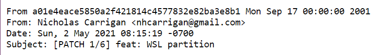

# Credit a Co-Author

When someone performs a PR review, they may use GitHub's "suggestion" feature to create a committable suggestion - if you commit this, you may have noticed that the commit credits them as a co-author.

However, what if the reviewer does not create a suggestion, but still provides code that you add to your pull request? You can manually give them that same co-author credit so their contributions are recognised.

## Getting the `git` email

In order to attach credit to their GitHub account, you will need their name and email address. To obtain this, find a commit they have made on the repository and view the commit. You should see a URL similar to `https://github.com/nhcarrigan/code-snippets/commit/27c108fa54d5fdca9a76d0721a9808b7f1c77f3f`.

Edit that URL to add `.patch` at the end, like so: `https://github.com/nhcarrigan/code-snippets/commit/27c108fa54d5fdca9a76d0721a9808b7f1c77f3f.patch`. Now you should see the raw commit data. The information you are looking for is at the top:



The information you need is in the `from` field.

## Adding the Attribution

When you are ready to commit your local changes, use `git commit` as you normally would (without the `-m` flag) to open up the commit message in your default editor.

Add your message on the first line, and any information for the body in the following lines. Then, at the bottom of the body, add:

```txt
Co-authored-by: Name <email>
```

Replace the placeholders with the information in your `from` field from the `.patch` URL above:

```txt
Co-authored-by: Naomi Carrigan <nhcarrigan@gmail.com>
```

Now when you push the commit up to your remote branch, you should see that the other user has also been given credit for that commit!
