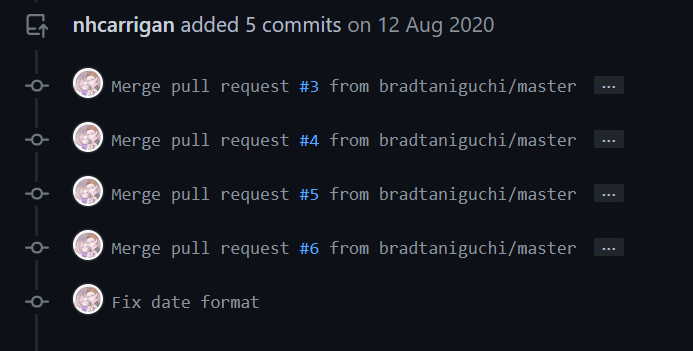

# Update Fork

Often times your fork will become out of sync with the source repository, as other contributors or maintainers make commits to the `main` branch.

GitHub will offer a nice UI for creating a pull request to bring your fork back in to sync with the source, but then you run in to this mess:



Instead, use this script to get your fork up to date cleanly.

```bash
git checkout main
git fetch upstream
git reset --hard upstream/main
git push --force
```

> [!TIP]
> If the default branch is something other than `main`, replace `main` in these commands with the correct default branch name.

If you do not have the `upstream` (source repository) configured locally, use this:

```bash
git remote add upstream <git url>
```
